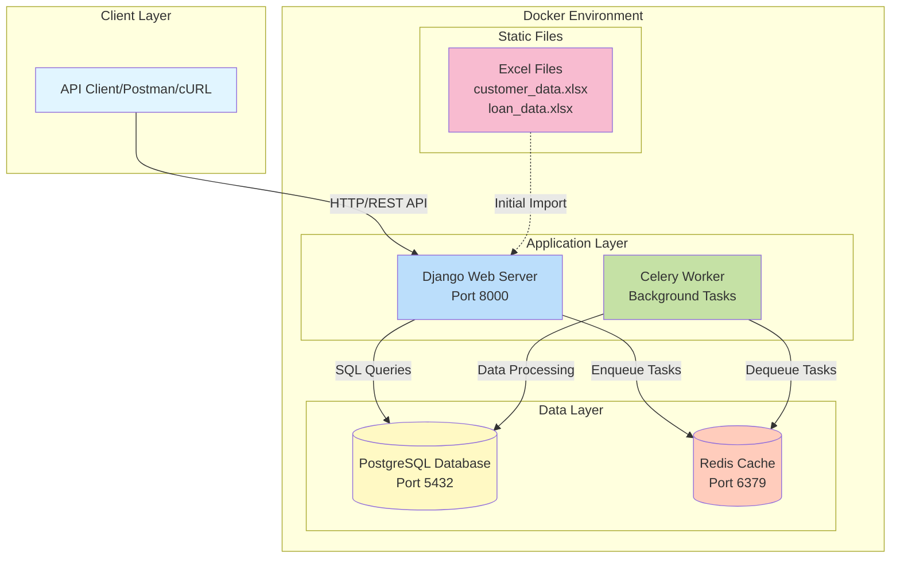

# Credit Approval System - Backend Assignment

A Django REST Framework-based credit approval system that evaluates loan eligibility based on historical customer data and credit scoring algorithms.

# System Architecture Diagram


##  Overview

This project implements a credit approval system with the following capabilities:
- Customer registration with automatic credit limit calculation
- Credit score calculation based on loan history
- Loan eligibility checking with dynamic interest rate correction
- Loan creation and management
- Comprehensive API endpoints for all operations

## Architecture

### Technology Stack
- **Framework**: Django 6.0.3 with Django REST Framework 3.16.1
- **Database**: PostgreSQL 15
- **Task Queue**: Celery 5.3.4 with Redis 7
- **Language**: Python 3.12
- **Containerization**: Docker & Docker Compose

### Project Structure
```
credit_approval_system/
├── credit_system/              # Django project configuration
│   ├── settings.py            # Project settings
│   ├── urls.py                # Main URL configuration
│   ├── celery.py              # Celery configuration
│   └── wsgi.py                # WSGI configuration
├── loans/                      # Main application
│   ├── models.py              # Customer and Loan models
│   ├── views.py               # API endpoints
│   ├── serializers.py         # DRF serializers
│   ├── utils.py               # Credit score & eligibility logic
│   ├── urls.py                # App URL routing
│   └── management/
│       └── commands/
│           └── import_data.py # Data ingestion command
├── customer_data.xlsx         # Initial customer data
├── loan_data.xlsx             # Historical loan data
├── docker-compose.yml         # Docker services configuration
├── Dockerfile                 # Application container definition
├── entrypoint.sh              # Container startup script
├── requirements.txt           # Python dependencies
└── test_apis.py              # API testing script
```

##  Quick Start

### Prerequisites
- Docker and Docker Compose installed
- Excel files (`customer_data.xlsx` and `loan_data.xlsx`) in project root

### Running the Application

1. **Clone the repository**
```bash
git clone <repository-url>
cd credit_approval_system
```

2. **Ensure Excel files are present**
```bash
ls *.xlsx
# Should show: customer_data.xlsx  loan_data.xlsx
```

3. **Start all services with a single command**
```bash
docker compose up --build
```

This command will:
- Build the Docker images
- Start PostgreSQL database
- Start Redis server
- Run database migrations
- Import customer and loan data automatically
- Start Django development server (port 8000)
- Start Celery worker

4. **Verify the application is running**
```bash
# Check service health
docker compose ps

# The output should show all services as "healthy" or "running"
```

The API will be available at: `http://localhost:8000/api/`

##  Data Models

### Customer Model
```python
- customer_id (AutoField, Primary Key)
- first_name (CharField)
- last_name (CharField)
- age (IntegerField, min=18)
- phone_number (BigIntegerField)
- monthly_salary (DecimalField)
- approved_limit (DecimalField)
- current_debt (DecimalField, default=0)
```

### Loan Model
```python
- loan_id (AutoField, Primary Key)
- customer (ForeignKey to Customer)
- loan_amount (DecimalField)
- tenure (IntegerField, in months)
- interest_rate (DecimalField)
- monthly_repayment (DecimalField)
- emis_paid_on_time (IntegerField)
- start_date (DateField)
- end_date (DateField)
```

##  API Endpoints

### 1. Register Customer
**POST** `/api/register`

Register a new customer with automatic credit limit calculation.

**Request Body:**
```json
{
  "first_name": "John",
  "last_name": "Doe",
  "age": 30,
  "monthly_income": 50000,
  "phone_number": 9876543210
}
```

**Response (201 Created):**
```json
{
  "customer_id": 301,
  "name": "John Doe",
  "age": 30,
  "monthly_income": "50000.00",
  "approved_limit": "1800000.00",
  "phone_number": 9876543210
}
```

**Business Logic:**
- `approved_limit = 36 × monthly_salary` (rounded to nearest lakh)

---

### 2. Check Loan Eligibility
**POST** `/api/check-eligibility`

Evaluate loan eligibility based on credit score and financial criteria.

**Request Body:**
```json
{
  "customer_id": 1,
  "loan_amount": 200000,
  "interest_rate": 10,
  "tenure": 24
}
```

**Response (200 OK):**
```json
{
  "customer_id": 1,
  "approval": true,
  "interest_rate": "10.00",
  "corrected_interest_rate": "12.00",
  "tenure": 24,
  "monthly_installment": "9218.64"
}
```

**Credit Score Components:**
1. **Past Loans Paid on Time** (40 points)
   - Ratio of EMIs paid on time to total EMIs
2. **Number of Loans** (20 points)
   - Fewer loans = higher score
3. **Loan Activity in Current Year** (20 points)
   - Fewer new loans this year = higher score
4. **Loan Approved Volume** (10 points)
   - Lower debt relative to limit = higher score
5. **Current Debt Check** (10 points)
   - If current debt > approved limit, score = 0

**Approval Rules:**
- Credit Score > 50: Approve at requested rate
- 50 > Credit Score > 30: Approve at minimum 12% interest
- 30 > Credit Score > 10: Approve at minimum 16% interest
- Credit Score < 10: Reject
- Total EMIs > 50% of monthly salary: Reject

---

### 3. Create Loan
**POST** `/api/create-loan`

Create a new loan if eligible.

**Request Body:**
```json
{
  "customer_id": 1,
  "loan_amount": 200000,
  "interest_rate": 10,
  "tenure": 24
}
```

**Response - Approved (201 Created):**
```json
{
  "loan_id": 783,
  "customer_id": 1,
  "loan_approved": true,
  "message": "Loan approved successfully",
  "monthly_installment": "9218.64"
}
```

**Response - Rejected (200 OK):**
```json
{
  "loan_id": null,
  "customer_id": 1,
  "loan_approved": false,
  "message": "Credit score too low. Loan cannot be approved.",
  "monthly_installment": "9218.64"
}
```

---

### 4. View Loan Details
**GET** `/api/view-loan/<loan_id>`

Retrieve detailed information about a specific loan.

**Response (200 OK):**
```json
{
  "loan_id": 446,
  "customer": {
    "id": 1,
    "first_name": "Customer",
    "last_name": "Name",
    "phone_number": 9876543210,
    "age": 30
  },
  "loan_amount": "900000.00",
  "interest_rate": "17.92",
  "monthly_installment": "39978.00",
  "tenure": 86
}
```

---

### 5. View Customer Loans
**GET** `/api/view-loans/<customer_id>`

Retrieve all current loans for a customer.

**Response (200 OK):**
```json
[
  {
    "loan_id": 446,
    "loan_amount": "900000.00",
    "interest_rate": "17.92",
    "monthly_installment": "39978.00",
    "repayments_left": 86
  },
  {
    "loan_id": 512,
    "loan_amount": "500000.00",
    "interest_rate": "12.50",
    "monthly_installment": "22500.00",
    "repayments_left": 36
  }
]
```

##  Interest Calculation

The system uses **compound interest** for EMI calculation:

```
EMI = P × r × (1 + r)^n / ((1 + r)^n - 1)

Where:
  P = Principal loan amount
  r = Monthly interest rate (annual_rate / 12 / 100)
  n = Tenure in months
```

##  Testing

### Automated API Testing

Run the comprehensive test suite:

```bash
# Make sure the application is running
docker compose up

# In a new terminal, run tests
python test_apis.py
```

The test script covers:
- Customer registration
- Eligibility checking
- Loan creation
- Loan viewing
- Interest rate correction
- Error handling

### Manual Testing with cURL

```bash
# Register a new customer
curl -X POST http://localhost:8000/api/register \
  -H "Content-Type: application/json" \
  -d '{
    "first_name": "Test",
    "last_name": "User",
    "age": 25,
    "monthly_income": 50000,
    "phone_number": 9999999999
  }'

# Check eligibility
curl -X POST http://localhost:8000/api/check-eligibility \
  -H "Content-Type: application/json" \
  -d '{
    "customer_id": 1,
    "loan_amount": 100000,
    "interest_rate": 10,
    "tenure": 12
  }'

# View customer loans
curl http://localhost:8000/api/view-loans/1
```

##  Docker Services

### Service Configuration

| Service | Image | Port | Purpose |
|---------|-------|------|---------|
| **web** | Custom (Python 3.12) | 8000 | Django API server |
| **db** | postgres:15 | 5432 | PostgreSQL database |
| **redis** | redis:7-alpine | 6379 | Message broker |
| **celery** | Custom (Python 3.12) | - | Background worker |

### Docker Commands

```bash
# Start services
docker compose up

# Start in detached mode
docker compose up -d

# View logs
docker compose logs -f

# Stop services
docker compose down

# Rebuild and start
docker compose up --build

# View running services
docker compose ps

# Access database
docker compose exec db psql -U credit_user -d credit_db

# Access Django shell
docker compose exec web python manage.py shell

# Run migrations manually
docker compose exec web python manage.py migrate

# Import data manually
docker compose exec web python manage.py import_data
```

##  Data Ingestion

The system automatically imports data on startup using a Django management command:

```bash
# Manual data import (if needed)
docker compose exec web python manage.py import_data
```

**Import Process:**
1. Clears existing data (Loans first, then Customers)
2. Imports 300 customers from `customer_data.xlsx`
3. Imports 782 loans from `loan_data.xlsx`
4. Resets PostgreSQL sequences for auto-increment IDs
5. Ensures new records get correct sequential IDs

**Excel File Requirements:**
- **customer_data.xlsx** columns: Customer ID, First Name, Last Name, Age, Phone Number, Monthly Salary, Approved Limit, Current Debt
- **loan_data.xlsx** columns: Customer ID, Loan ID, Loan Amount, Tenure, Interest Rate, Monthly payment, EMIs paid on Time, Date of Approval, End Date

##  Configuration

### Environment Variables

The following environment variables are configured in `docker-compose.yml`:

```yaml
# Django Configuration
DJANGO_SECRET_KEY=django-insecure-docker-secret-key-change-in-production
DJANGO_DEBUG=True
DJANGO_ALLOWED_HOSTS=localhost,127.0.0.1

# PostgreSQL Configuration
POSTGRES_DB=credit_db
POSTGRES_USER=credit_user
POSTGRES_PASSWORD=credit_password
POSTGRES_HOST=db
POSTGRES_PORT=5432

# Celery Configuration
CELERY_BROKER_URL=redis://redis:6379/0
CELERY_RESULT_BACKEND=redis://redis:6379/0
```

### Database Configuration

The application automatically switches between PostgreSQL (Docker) and SQLite (local development) based on environment variables.

##  Key Features

### ✅ Completed Requirements

1. **Setup & Initialization**
   - ✅ Django 6.0+ with Django REST Framework
   - ✅ PostgreSQL database
   - ✅ Fully dockerized application
   - ✅ Automatic data ingestion on startup
   - ✅ Background worker (Celery) setup

2. **API Endpoints**
   - ✅ `/register` - Customer registration
   - ✅ `/check-eligibility` - Loan eligibility check
   - ✅ `/create-loan` - Loan creation
   - ✅ `/view-loan/<loan_id>` - Single loan details
   - ✅ `/view-loans/<customer_id>` - All customer loans

3. **Business Logic**
   - ✅ Credit score calculation (5 components)
   - ✅ Interest rate correction based on credit score
   - ✅ Compound interest EMI calculation
   - ✅ Comprehensive eligibility checks
   - ✅ Proper error handling and status codes

4. **Code Quality**
   - ✅ Clean code organization
   - ✅ Separation of concerns (models, views, serializers, utils)
   - ✅ Comprehensive test scripts
   - ✅ Docker best practices

##  Troubleshooting

### Common Issues

**1. Port already in use**
```bash
# Stop existing services
docker compose down

# Or change ports in docker-compose.yml
```

**2. Database connection errors**
```bash
# Restart services
docker compose restart

# Check database health
docker compose exec db pg_isready -U credit_user
```

**3. Data import issues**
```bash
# Check Excel files exist
ls *.xlsx

# Manually trigger import
docker compose exec web python manage.py import_data

# Check logs
docker compose logs web
```

**4. Sequence reset issues (duplicate key errors)**
```bash
# The entrypoint.sh automatically handles this, but if needed:
docker compose exec web python manage.py import_data
```

##  Development Notes

### Local Development (without Docker)

```bash
# Create virtual environment
python -m venv venv
source venv/bin/activate  # On Windows: venv\Scripts\activate

# Install dependencies
pip install -r requirements.txt

# Run migrations
python manage.py migrate

# Import data
python manage.py import_data

# Run server
python manage.py runserver
```

### Adding New Features

1. Models: Update `loans/models.py`
2. Serializers: Update `loans/serializers.py`
3. Views: Update `loans/views.py`
4. URLs: Update `loans/urls.py`
5. Run migrations: `docker compose exec web python manage.py makemigrations`

##  Database Schema

```sql
-- Customers Table
CREATE TABLE customers (
    customer_id SERIAL PRIMARY KEY,
    first_name VARCHAR(100),
    last_name VARCHAR(100),
    age INTEGER CHECK (age >= 18),
    phone_number BIGINT,
    monthly_salary DECIMAL(12, 2),
    approved_limit DECIMAL(12, 2),
    current_debt DECIMAL(12, 2) DEFAULT 0
);

-- Loans Table
CREATE TABLE loans (
    loan_id SERIAL PRIMARY KEY,
    customer_id INTEGER REFERENCES customers(customer_id) ON DELETE CASCADE,
    loan_amount DECIMAL(12, 2),
    tenure INTEGER,
    interest_rate DECIMAL(5, 2),
    monthly_repayment DECIMAL(12, 2),
    emis_paid_on_time INTEGER DEFAULT 0,
    start_date DATE,
    end_date DATE
);
```

##  Assignment Submission Checklist

- ✅ Django 4+ with DRF (using Django 6.0.3)
- ✅ Appropriate data models
- ✅ Fully dockerized with single `docker compose up` command
- ✅ PostgreSQL database
- ✅ Background workers for data ingestion (Celery)
- ✅ All 5 API endpoints implemented
- ✅ Compound interest calculation
- ✅ Credit score algorithm with 5 components
- ✅ Proper error handling and status codes
- ✅ Clean code organization
- ✅ Test scripts included
- ✅ Comprehensive documentation


