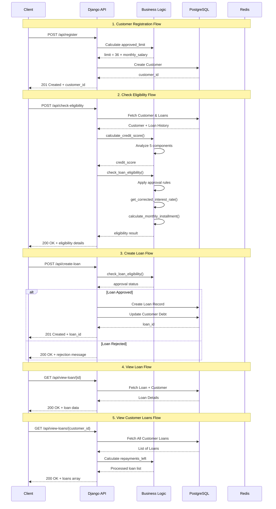

# API Flow Diagram

```mermaid
sequenceDiagram
    participant Client
    participant API as Django API
    participant Utils as Business Logic
    participant DB as PostgreSQL
    participant Redis

    Note over Client,Redis: 1. Customer Registration Flow
    Client->>API: POST /api/register
    API->>Utils: Calculate approved_limit
    Utils-->>API: limit = 36 × monthly_salary
    API->>DB: Create Customer
    DB-->>API: customer_id
    API-->>Client: 201 Created + customer_id

    Note over Client,Redis: 2. Check Eligibility Flow
    Client->>API: POST /api/check-eligibility
    API->>DB: Fetch Customer & Loans
    DB-->>API: Customer + Loan History
    API->>Utils: calculate_credit_score()
    Utils->>Utils: Analyze 5 components
    Utils-->>API: credit_score
    API->>Utils: check_loan_eligibility()
    Utils->>Utils: Apply approval rules
    Utils->>Utils: get_corrected_interest_rate()
    Utils->>Utils: calculate_monthly_installment()
    Utils-->>API: eligibility result
    API-->>Client: 200 OK + eligibility details

    Note over Client,Redis: 3. Create Loan Flow
    Client->>API: POST /api/create-loan
    API->>Utils: check_loan_eligibility()
    Utils-->>API: approval status
    alt Loan Approved
        API->>DB: Create Loan Record
        API->>DB: Update Customer Debt
        DB-->>API: loan_id
        API-->>Client: 201 Created + loan_id
    else Loan Rejected
        API-->>Client: 200 OK + rejection message
    end

    Note over Client,Redis: 4. View Loan Flow
    Client->>API: GET /api/view-loan/{id}
    API->>DB: Fetch Loan + Customer
    DB-->>API: Loan Details
    API-->>Client: 200 OK + loan data

    Note over Client,Redis: 5. View Customer Loans Flow
    Client->>API: GET /api/view-loans/{customer_id}
    API->>DB: Fetch All Customer Loans
    DB-->>API: List of Loans
    API->>Utils: Calculate repayments_left
    Utils-->>API: Processed loan list
    API-->>Client: 200 OK + loans array
```
