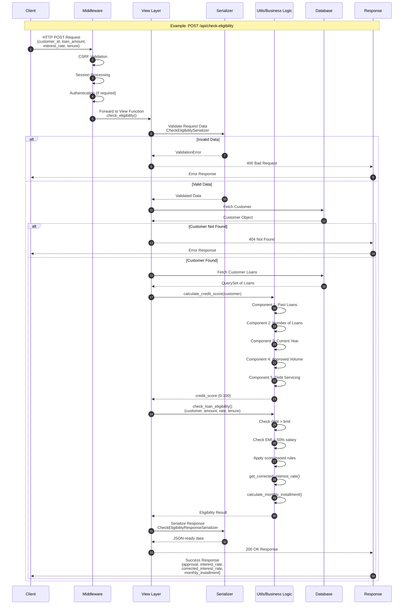

# API Request-Response Flow



## Response Status Codes

| Code | Meaning | When Used |
|------|---------|-----------|
| 200 | OK | Successful GET, eligibility check, loan view |
| 201 | Created | Successful customer registration, loan creation |
| 400 | Bad Request | Invalid input data, validation errors |
| 404 | Not Found | Customer or loan not found |
| 500 | Internal Server Error | Unexpected server errors |

## Error Response Format

```json
{
  "error": "Error message description",
  "details": {
    "field_name": ["Error detail for this field"]
  }
}
```
