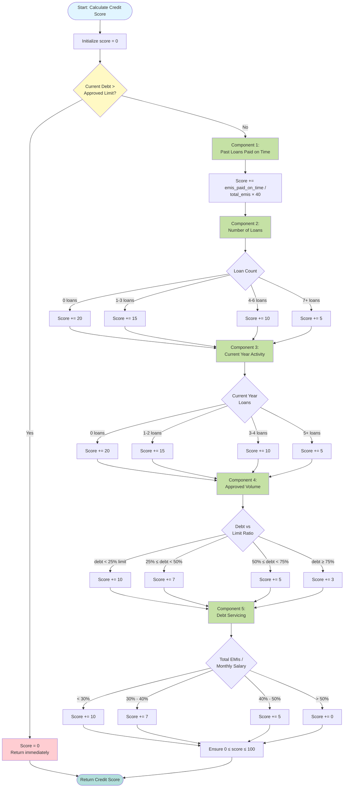

# Credit Score Calculation Algorithm

## Scoring Breakdown

| Component | Max Points | Criteria |
|-----------|------------|----------|
| Past Loans Paid on Time | 40 | EMIs paid on time / Total EMIs |
| Number of Loans | 20 | Fewer loans = Higher score |
| Current Year Activity | 20 | Fewer new loans = Higher score |
| Approved Volume | 10 | Lower debt ratio = Higher score |
| Debt Servicing Capability | 10 | Lower EMI/salary ratio = Higher score |
| **Total** | **100** | Sum of all components |

**Special Case**: If current debt > approved limit, score = 0 immediately.
