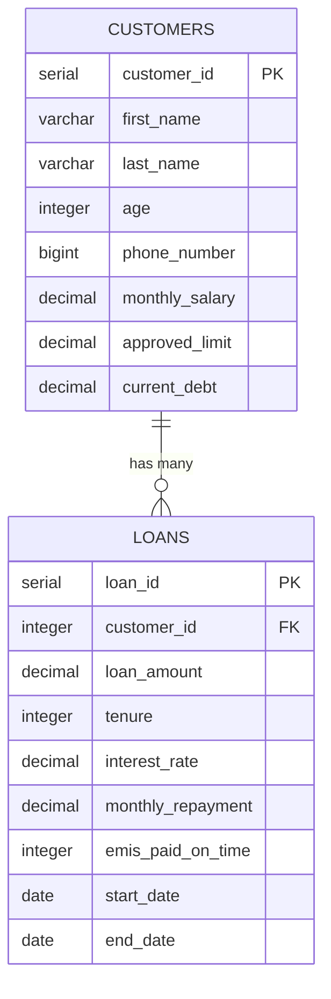

# Database Entity Relationship Diagram



## Table Details

### Customers Table
- **Primary Key**: `customer_id` (auto-increment)
- **Constraints**:
  - age ≥ 18
  - monthly_salary > 0
  - approved_limit ≥ 0
  - current_debt ≥ 0
- **Business Rule**: `approved_limit = 36 × monthly_salary` (rounded to nearest lakh)

### Loans Table
- **Primary Key**: `loan_id` (auto-increment)
- **Foreign Key**: `customer_id` references `customers(customer_id)`
  - ON DELETE: CASCADE
- **Constraints**:
  - loan_amount > 0
  - tenure ≥ 1 (in months)
  - interest_rate ≥ 0
  - monthly_repayment ≥ 0
  - emis_paid_on_time ≥ 0
- **Calculated Fields**:
  - `repayments_left` (computed property, not stored)

## Indexes

```sql
-- Primary Keys (automatic indexes)
CREATE INDEX idx_customers_pk ON customers(customer_id);
CREATE INDEX idx_loans_pk ON loans(loan_id);

-- Foreign Key (automatic index)
CREATE INDEX idx_loans_customer_fk ON loans(customer_id);

-- Recommended additional indexes
CREATE INDEX idx_customers_phone ON customers(phone_number);
CREATE INDEX idx_loans_dates ON loans(start_date, end_date);
CREATE INDEX idx_loans_customer_active ON loans(customer_id, end_date);
```
