# Deployment Flow

```mermaid
flowchart TD
    START([Developer: docker compose up --build]) --> BUILD_CHECK{Docker Images<br/>Exist?}
    
    BUILD_CHECK -->|No| BUILD[Build Docker Images]
    BUILD_CHECK -->|Yes, but --build flag| BUILD
    BUILD_CHECK -->|Yes, no --build flag| NETWORK
    
    BUILD --> BUILD_WEB[Build web image<br/>FROM python:3.12-slim]
    BUILD --> BUILD_CELERY[Build celery image<br/>FROM python:3.12-slim]
    
    BUILD_WEB --> COPY_FILES[Copy application files]
    BUILD_CELERY --> COPY_FILES
    COPY_FILES --> INSTALL_DEPS[Install requirements.txt]
    INSTALL_DEPS --> MAKE_EXEC[Make entrypoint.sh executable]
    MAKE_EXEC --> NETWORK
    
    NETWORK[Create Docker Network<br/>app-network] --> VOLUME[Create Persistent Volume<br/>postgres_data]
    
    VOLUME --> START_DB[Start db container<br/>PostgreSQL 15]
    VOLUME --> START_REDIS[Start redis container<br/>Redis 7]
    
    START_DB --> HEALTH_DB{Database<br/>Health Check}
    HEALTH_DB -->|Retry| HEALTH_DB
    HEALTH_DB -->|Healthy| DB_READY[DB Ready]
    
    START_REDIS --> HEALTH_REDIS{Redis<br/>Health Check}
    HEALTH_REDIS -->|Retry| HEALTH_REDIS
    HEALTH_REDIS -->|Healthy| REDIS_READY[Redis Ready]
    
    DB_READY --> CHECK_DEPS{Dependencies<br/>Ready?}
    REDIS_READY --> CHECK_DEPS
    
    CHECK_DEPS -->|Yes| START_WEB[Start web container]
    
    START_WEB --> RUN_ENTRY[Execute entrypoint.sh]
    
    RUN_ENTRY --> WAIT_PG[Wait for PostgreSQL<br/>Connection]
    WAIT_PG -->|Connected| RUN_MIG[Run Migrations<br/>python manage.py migrate]
    
    RUN_MIG --> IMPORT{Excel Files<br/>Exist?}
    IMPORT -->|Yes| RUN_IMPORT[Import Data<br/>python manage.py import_data]
    IMPORT -->|No| SKIP_IMPORT[Skip Import]
    
    RUN_IMPORT --> RESET_SEQ[Reset PostgreSQL Sequences]
    RESET_SEQ --> START_SERVER
    SKIP_IMPORT --> START_SERVER
    
    START_SERVER[Start Django Server<br/>0.0.0.0:8000] --> WEB_READY[Web Server Ready]
    
    WEB_READY --> START_CELERY[Start celery container]
    START_CELERY --> CELERY_CONNECT[Connect to Redis<br/>& Database]
    CELERY_CONNECT --> CELERY_READY[Celery Worker Ready]
    
    CELERY_READY --> EXPOSE[Expose Ports:<br/>8000, 5432, 6379]
    
    EXPOSE --> COMPLETE([✓ System Ready<br/>API Available at<br/>http://localhost:8000])
    
    style START fill:#e1f5ff
    style BUILD fill:#bbdefb
    style START_DB fill:#fff9c4
    style START_REDIS fill:#ffccbc
    style START_WEB fill:#c5e1a5
    style RUN_IMPORT fill:#f8bbd0
    style COMPLETE fill:#b2dfdb
```



## Deployment Commands

```bash
# Full deployment (rebuild everything)
docker compose up --build

# Start existing containers
docker compose up

# Detached mode (background)
docker compose up -d

# View logs
docker compose logs -f

# Stop all containers
docker compose down

# Stop and remove volumes (clean slate)
docker compose down -v
```
