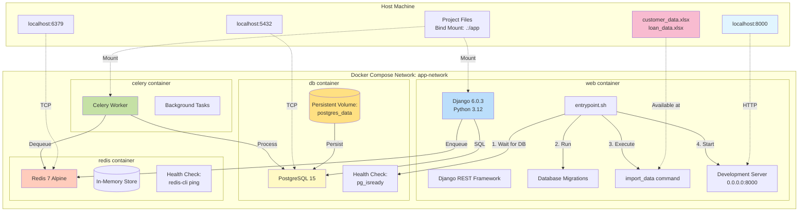
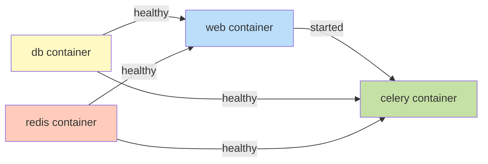

# Docker Container Architecture

## Container Dependencies

## Startup Sequence

1. **db** and **redis** containers start
2. Health checks verify services are ready
3. **web** container starts after dependencies are healthy
4. `entrypoint.sh` executes:
   - Waits for PostgreSQL connection
   - Runs database migrations
   - Imports Excel data
   - Starts Django server
5. **celery** container starts after web is ready
