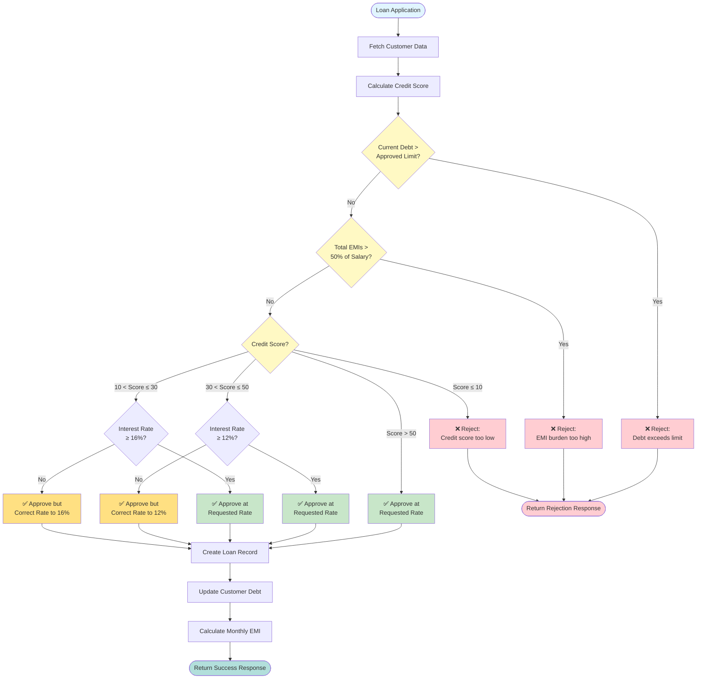

# Loan Approval Decision Flow

## Interest Rate Correction Rules

| Credit Score Range | Minimum Interest Rate | Action |
|-------------------|----------------------|---------|
| > 50 | No minimum | Approve at requested rate |
| 30 - 50 | 12% | Correct if requested < 12% |
| 10 - 30 | 16% | Correct if requested < 16% |
| < 10 | N/A | Reject loan |
