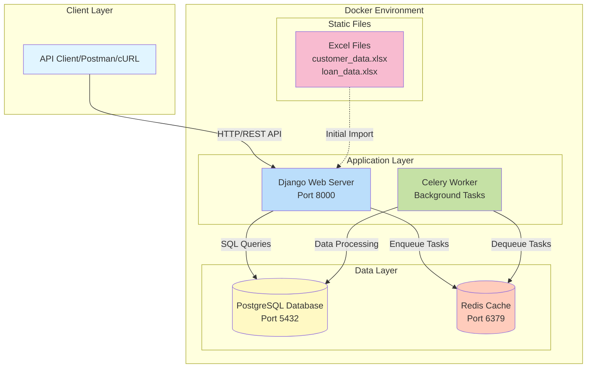

# System Architecture Diagram

## Key Components

- **Django Web Server**: Handles API requests and business logic
- **Celery Worker**: Processes background tasks asynchronously
- **PostgreSQL**: Primary data store for customers and loans
- **Redis**: Message broker for Celery task queue
- **Excel Files**: Source data for initial system setup
